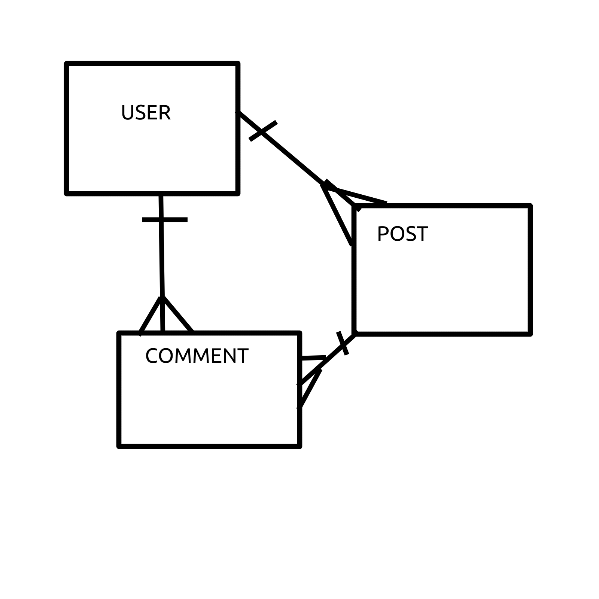

# Blog App Api

An API built for use with <blog-app-client> Blog Application utilizing the following technologies:
*Node.js
*Express.js
*Mongoose
*MongoDB

This API is built to be used as the back-end for a blog application. It allows bloggers to register as users of the API and post their own blogs as well as comment on blogs owned by other users.

## URL's

```js
  front-end Application: ''
  production: ''
```

## API End Points

| Verb   | URI Pattern            |
|--------|------------------------|
| POST   | `/sign-up`             |
| POST   | `/sign-in`             |
| DELETE | `/sign-out`            |
| PATCH  | `/change-password`     |
| GET    | `/posts`               |
| POST   | `/posts`               |
| GET    | `/posts/:id`           |
| PATCH  | `/posts/:id`           |
| DELETE | `/posts/:id`           |


## Goals for V2
*add the abitlity to start a discussion by adding additional comments on to existing comments.


## Development
  The first thing to do was to create an ERD to plan out any relationships that we will need to utilize in our database.
  For our blog application we will need to create a model for our blog posts, which will be owned by a user, and a model for comments that will also be owned by a user as well as a blog post. We then need to create routes so that we can CRUD over blogs and comments.

## Entity Relationship Diagram


